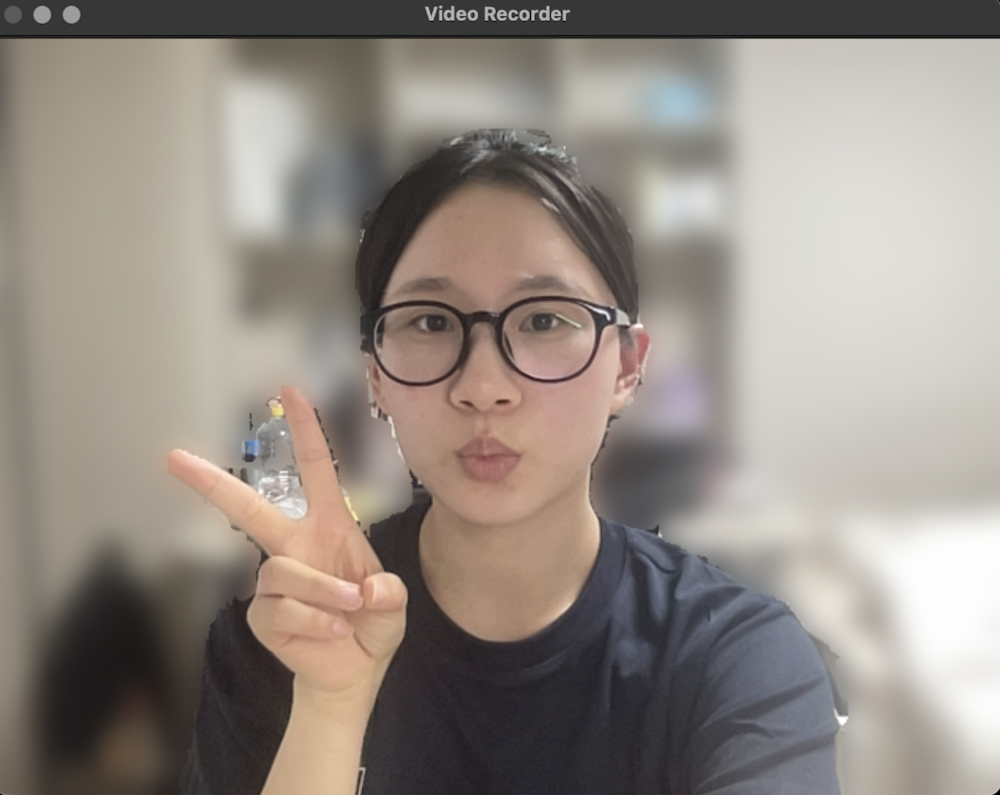
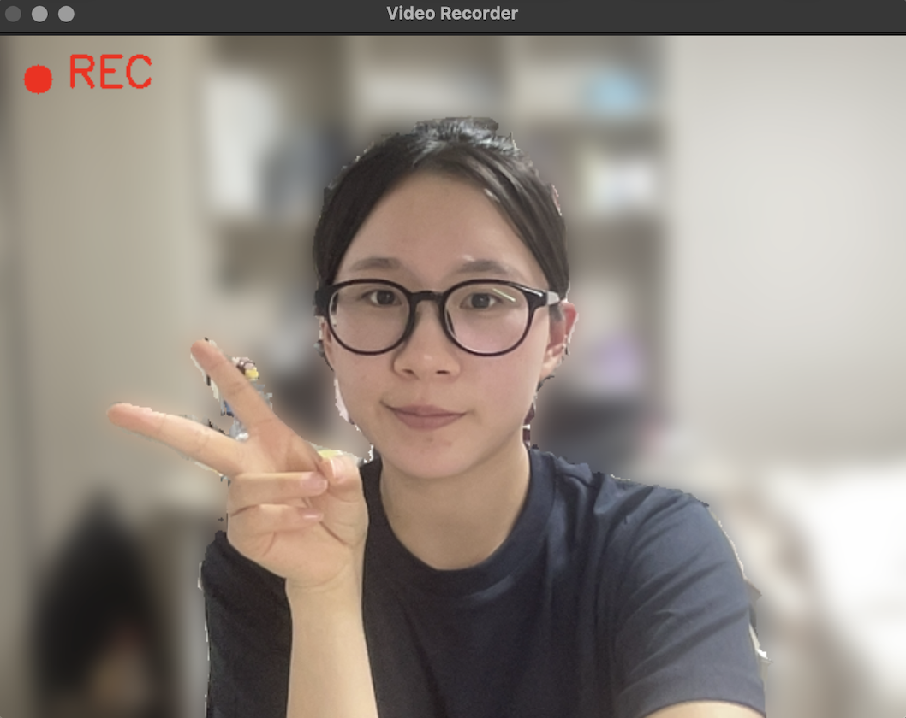

# My Video Recorder

OpenCV를 이용하여 웹캠 영상을 실시간으로 확인하고 녹화할 수 있는 간단한 비디오 레코더입니다.

---

## 📌 주요 기능

- 웹캠 영상 실시간 출력 (Preview)
- Space 키를 이용한 녹화 시작 / 중지
- 녹화 중 화면에 빨간 원(🔴) REC 표시
- ESC 키를 이용한 프로그램 종료

- 좌우 반전 기능
- MediaPipe를 이용한 사람 영역 분리 (누끼)
- 사람을 제외한 배경 블러 처리 기능
- MP4 형식으로 영상 저장 (코덱: mp4v)

---

## 🛠 실행 방법

```bash
python main.py
```

---

## 🎮 사용 방법

- `Space` : 녹화 시작 / 중지
- `ESC` : 프로그램 종료

---

## 💾 결과

- 녹화된 영상은 `output.mp4` 파일로 저장됩니다.

---

## 📷 실행 화면

### ▶️ 기본 화면



### 🔴 녹화 중 화면



---

## ⚙️ 개발 환경

- Python
- OpenCV
- MediaPipe
- NumPy

---

## 📖 설명

OpenCV의 `VideoCapture`를 이용하여 카메라 영상을 받아오고, `VideoWriter`를 사용하여 영상을 파일로 저장하도록 구현하였습니다.
또한, 키보드 입력을 통해 Preview 모드와 Record 모드를 전환할 수 있도록 구성하였습니다.
추가로, MediaPipe를 활용하여 사람을 인식하고, 배경에 블러 효과를 적용하는 기능을 추가하였습니다.

- FPS: 20
- Codec (FourCC): mp4v
